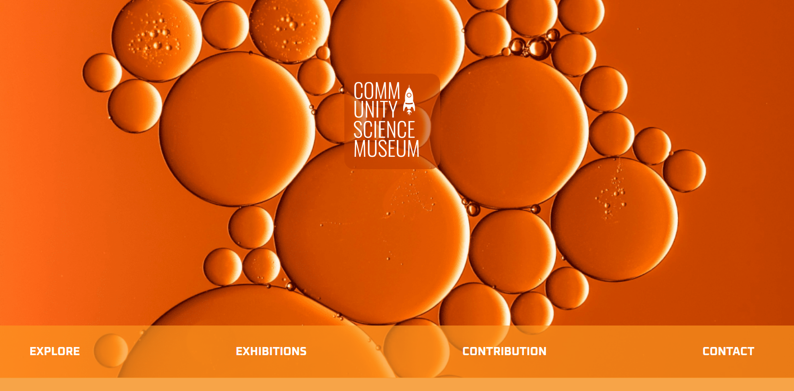

# Community Science Museum 🧪🔬

## 📖 Table of Contents
1. [Introduction](#introduction)
2. [Features](#features)
3. [Technologies Used](#technologies-used)
4. [Getting Started](#getting-started)
5. [Project Structure](#project-structure)
6. [Future Improvements](#future-improvements)
7. [Acknowledgements](#acknowledgements)

---

## 🧑‍🔬 Introduction
This is a simple, static website I created for the **Community Science Museum**, built entirely with HTML and CSS. The goal of the site is to inform visitors about the museum’s exhibits and events, while maintaining a clean and responsive design. I focused on ensuring the site looks great across devices and provides an engaging experience for users interested in science!

You can check it out live here: [community-science-museum-idatold.netlify.app](https://community-science-museum-idatold.netlify.app/) 🌐

## 🌟 Features
- 🏛️ Fully responsive design to look good on any device.
- 🧬 Visual sections showcasing various science exhibits.
- 🧑‍🏫 Informative content about upcoming events and the museum’s mission.

## 🛠 Technologies Used
- HTML 📝
- CSS 🎨

## 🚀 Getting Started
You can view the site by simply visiting the live version—no setup needed! Just explore and enjoy. 🌍

## 🗂 Project Structure
- `/css`: Where all the styles for the site are located. 🎨
- `/images`: Contains visuals and exhibit images used throughout the site. 📸
- `index.html`: The main page of the website. 🏠

## 🔮 Future Improvements
- 🎨 I’d love to add some CSS animations to make the exhibits more interactive.
- 📅 Adding a dynamic calendar for museum events would be cool.
- 📊 Looking to improve load times and performance optimization in the future.

## 💖 Acknowledgements
Thanks to my caffeine boosts ☕ and the late nights I spent coding! Also, a big shout-out to all the learning resources that helped along the way. 💖

